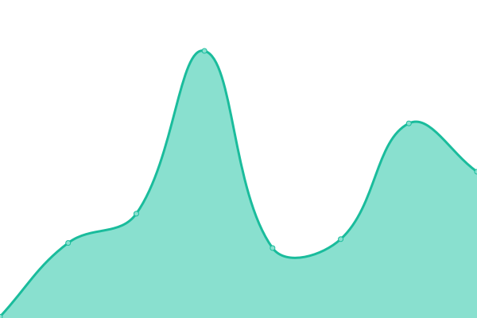

# [📈 Live Status](https://upptime.github.io/upptime): <!--live status--> **🟧 Partial outage**

This repository contains the open-source uptime monitor and status page for [Upptime](https://upptime.js.org), powered by [Upptime](https://github.com/upptime/upptime).

With [Upptime](https://upptime.js.org), you can get your own unlimited and free uptime monitor and status page, powered entirely by a GitHub repository. We use [Issues](https://github.com/upptime/upptime/issues) as incident reports, [Actions](https://github.com/brewinteractive/upptime/actions) as uptime monitors, and [Pages](https://upptime.github.io/upptime) for the status page.

<!--start: status pages-->
<!-- This summary is generated by Upptime (https://github.com/upptime/upptime) -->
<!-- Do not edit this manually, your changes will be overwritten -->
<!-- prettier-ignore -->
| URL | Status | History | Response Time | Uptime |
| --- | ------ | ------- | ------------- | ------ |
|  [20 Megatons (API)](https://api.20megatons.com/) | 🟩 Up | [20-megatons-api.yml](https://github.com/BrewInteractive/upptime/commits/HEAD/history/20-megatons-api.yml) | 

 482ms
     
 | 

<a href="https://brewinteractive.github.io/upptime/history/20-megatons-api">100.00%</a>
    

|  [20 Megatons (Landing)](https://20megatons.com/) | 🟩 Up | [20-megatons-landing.yml](https://github.com/BrewInteractive/upptime/commits/HEAD/history/20-megatons-landing.yml) | 

 2373ms
     
 | 

<a href="https://brewinteractive.github.io/upptime/history/20-megatons-landing">100.00%</a>
    

|  [Brewww](https://brewww.com/) | 🟩 Up | [brewww.yml](https://github.com/BrewInteractive/upptime/commits/HEAD/history/brewww.yml) | 

 598ms
     
 | 

<a href="https://brewinteractive.github.io/upptime/history/brewww">100.00%</a>
    

|  [Villa Sepeti](https://villasepeti.com/) | 🟩 Up | [villa-sepeti.yml](https://github.com/BrewInteractive/upptime/commits/HEAD/history/villa-sepeti.yml) | 

 1047ms
     
 | 

<a href="https://brewinteractive.github.io/upptime/history/villa-sepeti">100.00%</a>
    

|  [Kansersiz Hayat](https://kansersizhayat.com/) | 🟩 Up | [kansersiz-hayat.yml](https://github.com/BrewInteractive/upptime/commits/HEAD/history/kansersiz-hayat.yml) | 

 638ms
     
 | 

<a href="https://brewinteractive.github.io/upptime/history/kansersiz-hayat">100.00%</a>
    

|  [KS Koç Sistem](https://www.kocsistem.com.tr) | 🟩 Up | [ks-koc-sistem.yml](https://github.com/BrewInteractive/upptime/commits/HEAD/history/ks-koc-sistem.yml) | 

 3094ms
     
 | 

<a href="https://brewinteractive.github.io/upptime/history/ks-koc-sistem">98.56%</a>
    

|  [KS Aile Saati](https://ailesaati.kocsistem.com.tr/) | 🟩 Up | [ks-aile-saati.yml](https://github.com/BrewInteractive/upptime/commits/HEAD/history/ks-aile-saati.yml) | 

 3619ms
     
 | 

<a href="https://brewinteractive.github.io/upptime/history/ks-aile-saati">96.89%</a>
    

|  [KS Apple](https://apple.kocsistem.com.tr/) | 🟩 Up | [ks-apple.yml](https://github.com/BrewInteractive/upptime/commits/HEAD/history/ks-apple.yml) | 

 1895ms
     
 | 

<a href="https://brewinteractive.github.io/upptime/history/ks-apple">99.18%</a>
    

|  [KS Azure](https://azure.kocsistem.com.tr/) | 🟩 Up | [ks-azure.yml](https://github.com/BrewInteractive/upptime/commits/HEAD/history/ks-azure.yml) | 

 2143ms
     
 | 

<a href="https://brewinteractive.github.io/upptime/history/ks-azure">99.47%</a>
    

|  [KS Pixage](https://www.pixage.com.tr/) | 🟩 Up | [ks-pixage.yml](https://github.com/BrewInteractive/upptime/commits/HEAD/history/ks-pixage.yml) | 

 756ms
     
 | 

<a href="https://brewinteractive.github.io/upptime/history/ks-pixage">99.94%</a>
    

|  [KS Techsquare](https://www.techsquare.com.tr/) | 🟥 Down | [ks-techsquare.yml](https://github.com/BrewInteractive/upptime/commits/HEAD/history/ks-techsquare.yml) | 

 0ms
     
 | 

<a href="https://brewinteractive.github.io/upptime/history/ks-techsquare">0.00%</a>
    

|  [KS Workplace](https://workplace.kocsistem.com.tr/) | 🟩 Up | [ks-workplace.yml](https://github.com/BrewInteractive/upptime/commits/HEAD/history/ks-workplace.yml) | 

 4172ms
     
 | 

<a href="https://brewinteractive.github.io/upptime/history/ks-workplace">97.44%</a>
    

|  [UIP](https://www.uip.com.tr/) | 🟩 Up | [uip.yml](https://github.com/BrewInteractive/upptime/commits/HEAD/history/uip.yml) | 

 419ms
     
 | 

<a href="https://brewinteractive.github.io/upptime/history/uip">100.00%</a>
    

|  [KS Dijital iş Gücü](https://dijitalisgucu.kocsistem.com.tr/) | 🟩 Up | [ks-dijital-is-guecue.yml](https://github.com/BrewInteractive/upptime/commits/HEAD/history/ks-dijital-is-guecue.yml) | 

 2138ms
     
 | 

<a href="https://brewinteractive.github.io/upptime/history/ks-dijital-is-guecue">99.19%</a>
    

|  [KS Dijital Academy](https://kocdigitalacademy.com) | 🟩 Up | [ks-dijital-academy.yml](https://github.com/BrewInteractive/upptime/commits/HEAD/history/ks-dijital-academy.yml) | 

 3375ms
     
 | 

<a href="https://brewinteractive.github.io/upptime/history/ks-dijital-academy">99.52%</a>
    

<!--end: status pages-->

## 📄 License

- Powered by: [Upptime](https://github.com/upptime/upptime)
- Code: [MIT](./LICENSE) © [Anand Chowdhary](https://anandchowdhary.com), supported by [Pabio](https://pabio.com)
- Data in the `./history` directory: [Open Database License](https://opendatacommons.org/licenses/odbl/1-0/)
